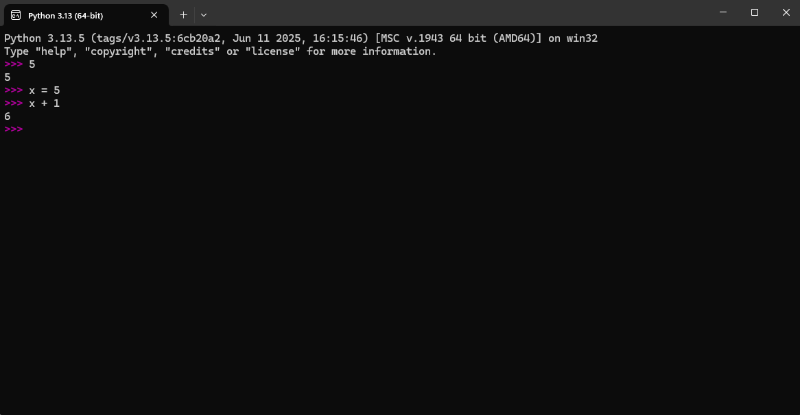

**Exercise 1:** Type the following statements in the Python interpreter to see what
 they do:

    >>> 5
    >>> x = 5 
    >>> x + 1

**Answer:**

 

When I typed the 5 it went right back in the console, but for the declaration of the variable
it just "Learn it" and later on could do a calculation with that information.

**Exercise 4:** Assume that we execute the following assignment statements:

    width = 17
    height = 12.0

 For each of the following expressions, write the value of the expression and the
 type (of the value of the expression). 
 Use the Python interpreter to check your answers.

**Answers:**

| Expressions      | Value of the Expression |  Type   |
|:-----------------|:-----------------------:|:-------:|
| **1.** width//2  |            8            |  int()  |  
| **2.** width/2.0 |           8.5           | float() | 
| **3.** height/3  |            4            |  int()  |
| **4.** 1 + 2 * 5 |           11            |  int()  | 
 

My answers were almost all correct, except for the number 3. I had to look it up and any division in the newest
version of python generates a float, even if both the numbers are integers.

