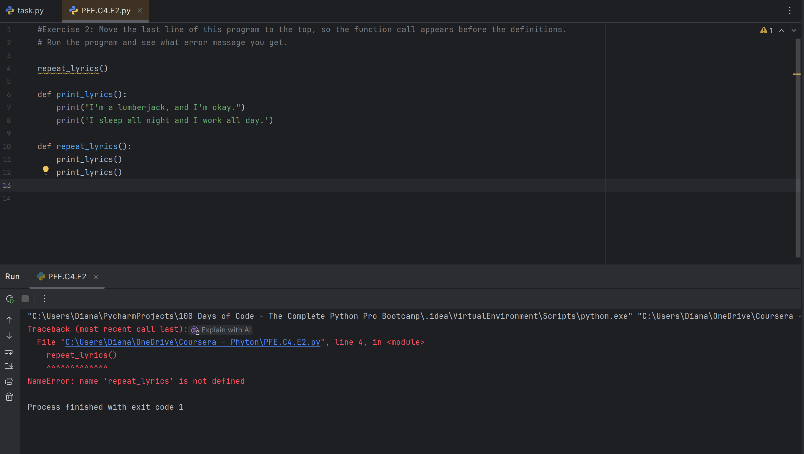
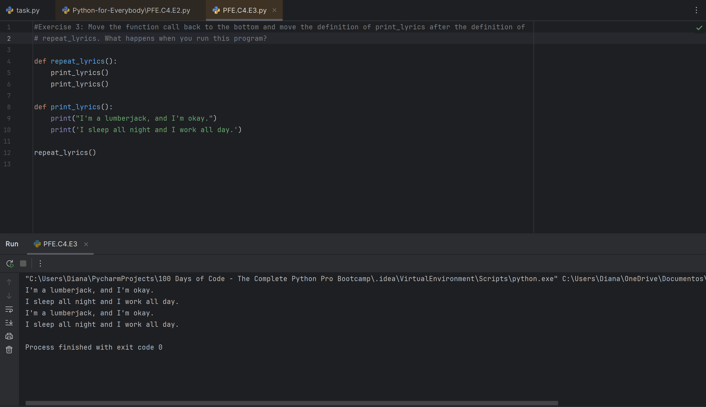

# Python for Everybody – Chapter 4 Exercises

## 📘 Introduction

This file contains my answers to the exercises from Chapter 4 of the book  
**"Python for Everybody"** by Dr. Charles Severance (Dr. Chuck).

In this chapter, I explored how functions help organize code into reusable blocks. I learned how to define functions 
using `def`, how to pass information with parameters, and how to use `return` values to send data back. The chapter also 
covered how functions make code cleaner, easier to understand, and more flexible: a core concept in writing good Python programs.

Some exercises involved writing or analyzing small pieces of code, those exercises are in this file, while the others that 
focused on understanding how functions behave and how they can simplify repetitive tasks have their own separate Python file.

---

## 📝 Exercises

### **Exercise 2:** Move the last line of this program to the top, so the function call appears before the definitions. 
Run the program and see what error message you get.

*Program changed:*

``` 
repeat_lyrics() 

def print_lyrics():
    print("Im a lumberjack, and Im okay.")
    print(I sleep all night and I work all day.)
    
def repeat_lyrics():
    print_lyrics()
    print_lyrics()
    
 ```
***Answer:***


Te result of running this modified code is the <span style="color: red">NameError: name  'repeat_lyrics' is not defined</span>
Given that the way the programs is run the definition of functions has to be before the call to action of those functions.

---

### **Exercise 3:** Move the function call back to the bottom and move the definition of print_lyrics after the definition 
of repeat_lyrics. What happens when you run this program?

``` 
def repeat_lyrics():
    print_lyrics()
    print_lyrics()
    
def print_lyrics():
    print("Im a lumberjack, and Im okay.")
    print(I sleep all night and I work all day.)
    
repeat_lyrics() 
    
 ```

***Answer:***


I guess that this exercise has of objective to be able to see that the call for action of the code has to be 
after the definition of sayed function, but the order of how the definition of each function does not make a difference on how 
it runs because this code had no error or traceback.

---

### **Exercise 4:** What is the purpose of the “def” keyword in Python?

***Answer:***

**d)** b and c are both true

    b) It indicates the start of a function
    c) It indicates that the following indented section of code is to be stored for later

---

### **Exercise 5:** What will the following Python program print out?

```
def fred():
    print("Zap")
    
def jane():
    print("ABC")
    
jane()
fred()
jane()
```

***Answer:***

**d)** ABC Zap ABC

---

